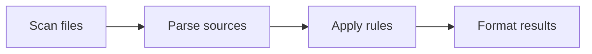

# Architecture

Design Lint processes files in three stages: discovery, linting and formatting.

1. **Scanning** – glob patterns resolve to a list of files. Ignore files and configuration influence the set.
2. **Parsing** – language specific parsers convert sources to ASTs. CSS is handled with PostCSS; JS/TS uses the TypeScript compiler. Vue and Svelte files are compiled before linting.
3. **Linting** – each rule receives nodes and reports messages. Rules may provide fix functions.
4. **Formatting** – results are written using the selected formatter.

See the [source code](../src) for module implementations and the [Plugin guide](plugins.md) for extending the engine.
