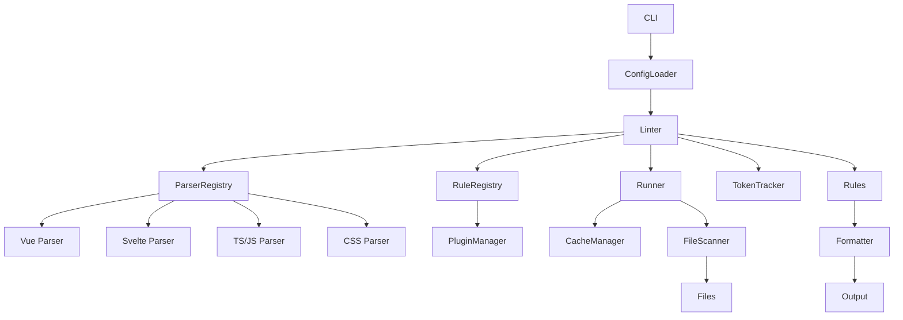

# Architecture Overview

This document describes the major pieces that power `@lapidist/design-lint`.

## Linter Core

The `Linter` class in [`src/core/linter.ts`](../src/core/linter.ts) orchestrates
specialized modules. `RuleRegistry` registers built-in rules and loads any
plugins. A `parserRegistry` in [`src/core/parser-registry.ts`](../src/core/parser-registry.ts)
resolves language-specific strategies—Vue, Svelte, TypeScript/JavaScript, and
CSS—that parse source files and dispatch AST nodes and CSS declarations to rule
listeners. `TokenTracker` records which design tokens are used so
`design-system/no-unused-tokens` can report leftovers. File discovery and cache
management are delegated to the [`Runner`](../src/core/runner.ts), allowing the
linter to focus on rule coordination and parsing.

## Rule Lifecycle

Rules expose a `name`, `meta.description`, and a `create` function. When linting
begins, configuration enables specific rules with a severity and optional
options. The engine calls each rule’s `create` function with a `context`
providing `tokens`, `options`, `filePath`, and a `report` method. The returned
listener hooks (`onNode`, `onCSSDeclaration`, etc.) run as the engine walks the
parsed source. When a rule detects a problem it reports a `LintMessage`; fixes
are collected and applied after all listeners finish.

## Plugin Loading

Plugins extend the rule set by exporting an object like `{ rules: RuleModule[] }`.
[`plugin-manager.ts`](../src/core/plugin-manager.ts) resolves each plugin
relative to the config file and uses dynamic `import` when necessary. Each rule
is validated for shape and uniqueness before being added to the rule map.
Loading errors clearly identify the plugin and suggest remediation.

## File Scanning and Ignoring

The [`file-service.ts`](../src/core/file-service.ts) module gathers target files
based on glob patterns and consults ignore files via [`ignore.ts`](../src/core/ignore.ts).
The `Runner` consumes this service, keeping the core linter focused on analysis
while delegating filesystem concerns to dedicated helpers.

## Configuration Resolution

Configuration is resolved through [`loadConfig`](../src/config/loader.ts). It
searches upward from the current directory for `designlint.config.*` files,
supporting JavaScript, TypeScript, JSON, and ESM/CJS variants. Loaded settings
are merged with defaults, validated against a schema, and returned with absolute
paths. The resulting object supplies tokens, rule settings, plugins, and ignore
patterns consumed by the engine.

## Caching Subsystem

To avoid reprocessing unchanged files, `CacheManager` accepts an optional cache
map and location. The `Runner` populates the map with each file’s modification
time and `LintResult`, reading and writing to disk when `cacheLocation` is
provided. A separate `CacheService` handles pruning stale entries and saving the
cache after each run. Cache serialization lives in
[`src/core/cache.ts`](../src/core/cache.ts) and is coordinated by the runner.

## Formatting

Results are rendered through formatters such as `stylish`, `json`, or `sarif`.
`getFormatter` in [`src/formatters/index.ts`](../src/formatters/index.ts)
resolves a formatter by name and applies it to the collected `LintResult`s to
produce CLI output or machine-readable reports.

## Watch Workflow

The CLI supports `--watch` mode to re-lint files on the fly. Using
[`chokidar`](https://github.com/paulmillr/chokidar), it monitors target files,
the configuration file, ignore files, and plugin modules. When any of these
change, the CLI reloads configuration and plugins, clears caches, and invokes
the engine again. Dynamic imports with cache-busting query strings ensure ESM
plugins reload correctly. Implementation details can be found in
[`src/cli/index.ts`](../src/cli/index.ts).
